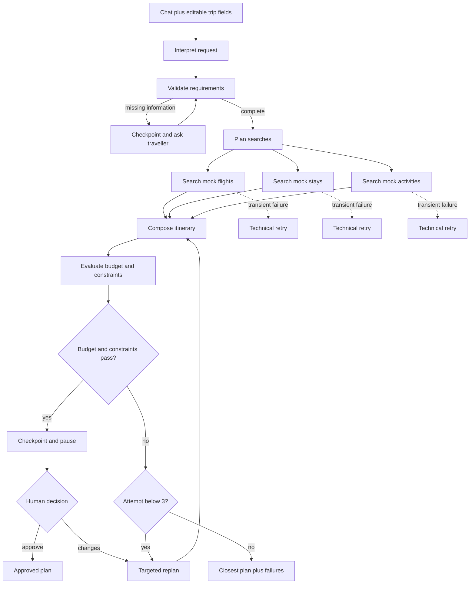

# Atlas — Transparent LangGraph Travel Planner

Atlas is a transparent Python LangGraph travel-planning application. The local Streamlit learning experience demonstrates state, parallel nodes, conditional edges, targeted replanning, technical retries, SQLite checkpoints and human-in-the-loop approval. A Vercel-compatible FastAPI endpoint and responsive dark web interface provide a public demo. Travel inventory is mock data; prices are illustrative and the app never books or pays for anything.

## Product flow



The initial plan is attempt 1. Atlas permits at most three total plan candidates in one planning cycle. A temporary service retry is separate and does not consume a planning attempt. Targeted replanning replaces only invalid or expensive categories and retains valid results. If a traveller rejects a valid itinerary and supplies new information, that feedback starts a fresh three-attempt cycle.

## Run locally

Requires Python 3.12.

```bash
python3 -m venv .venv
source .venv/bin/activate
pip install -r requirements.txt
cp .env.example .env
streamlit run app.py
```

The local Streamlit app uses durable SQLite checkpoints. The public Vercel demo runs the same LangGraph in a Python Function with short-lived in-memory checkpoints; a production release should replace this with managed PostgreSQL.

## Vercel public demo

Vercel serves `public/index.html` and the Python LangGraph API from `api/index.py`.

```bash
vercel deploy
vercel deploy --prod
```

Health check: `GET /api/health`. Planning: `POST /api/plan`. Approval: `POST /api/approval`.

Add an OpenAI API key to `.env` to interpret the natural-language request. Without a key, Atlas uses the editable fields, so the mock workflow remains fully usable.

## Test

```bash
pytest -q
```

## State and nodes

- `TripRequest`: origin, alternative origins, destination, dates, duration, travellers, budget, flight/stay/food/activity preferences, date flexibility and extension tolerance.
- `search_flights`, `search_stays`, `search_activities`: parallel mock-data specialists with technical retry policies.
- `evaluate_plan`: produces a transparent cost breakdown and failed-constraint list.
- `targeted_replan`: changes only affected searches; initial plan counts as attempt 1.
- `human_approval`: durable interrupt that can approve or resume with feedback.
- `audit_events`: structured operational explanations without exposing private chain-of-thought.

## V1 boundaries

- Learning app and public demo, not a booking engine.
- Mock inventory, not live availability or pricing.
- Airport-to-hotel transport is deferred.
- No accounts, cloud deployment, payments or booking actions.
- OpenAI is used only for structured request extraction when configured; planning and budget logic remain deterministic and testable.

## Production path

Replace each mock search node with a provider adapter, add caching and rate limits, move checkpoints to managed PostgreSQL, add authentication and observability, and require explicit approval before any external booking action.
